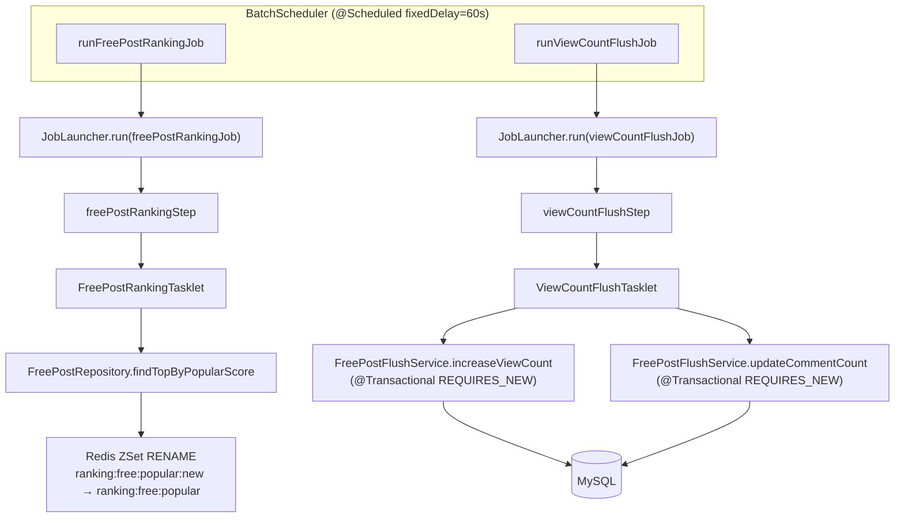

# ARCHITECTURE — pocat-batch

---

## 패키지 트리

```text
com.rocketcrew.pocatbatch/
├── PocatBatchApplication
├── client/
│   ├── MainAiReindexClient         # POST /internal/ai/reindex-cards (ADR-018, #222)
│   ├── MainAuctionLifecycleClient  # POST /internal/auctions/{id}/activate|close-expired (#235)
│   ├── MainCardSyncClient          # POST /internal/cards/sync (#235)
│   ├── MainAppBuyoutClient         # 즉시구매 처리 위임
│   └── MainAppRefundClient         # 환불 처리 위임
├── config/
│   ├── BatchConfig              # JobRepository, JobLauncher, TransactionManager 설정
│   ├── JpaConfig                # DataSource, EntityManagerFactory 설정
│   └── RedisConfig              # RedisTemplate, StringRedisTemplate 설정
├── domain/freepost/
│   ├── entity/
│   │   ├── BaseEntity           # createdAt, updatedAt (MappedSuperclass)
│   │   └── FreePost             # 자유게시판 게시글 엔티티 (메인 앱에서 복제)
│   ├── repository/
│   │   └── FreePostRepository   # JPA 레포지토리 (인기 점수 정렬 조회 포함)
│   └── service/
│       └── FreePostFlushService # 조회수·댓글수 DB 반영 (@Transactional REQUIRES_NEW)
├── job/
│   ├── auctionactivation/
│   │   ├── AuctionActivationJobConfig  # auctionActivationJob 빈 등록 (#235)
│   │   └── AuctionActivationTasklet    # APPROVED 경매 조회 → MainAuctionLifecycleClient.activate() (#235)
│   ├── auctionexpiration/
│   │   ├── AuctionExpirationJobConfig  # auctionExpirationJob 빈 등록 (#235)
│   │   └── AuctionExpirationTasklet    # 만료 ACTIVE 경매 조회 → MainAuctionLifecycleClient.closeExpired() (#235)
│   ├── cardsync/
│   │   ├── CardSyncJobConfig    # cardSyncJob 빈 등록 (#235)
│   │   └── CardSyncTasklet      # MainCardSyncClient.triggerSync() 1회 호출 (#235)
│   ├── aireindex/
│   │   ├── AiReindexJobConfig   # aiReindexJob, aiReindexStep 빈 등록 (ADR-018, #222)
│   │   └── AiReindexTasklet     # cursor 기반 카드ID 청크 조회 + MainAiReindexClient 호출
│   ├── ranking/
│   │   ├── FreePostRankingJobConfig   # freePostRankingJob, freePostRankingStep 빈 등록
│   │   └── FreePostRankingTasklet     # 랭킹 조회 → Redis ZSet RENAME
│   └── viewcount/
│       ├── ViewCountFlushJobConfig    # viewCountFlushJob, viewCountFlushStep 빈 등록
│       └── ViewCountFlushTasklet      # Redis 버퍼 → MySQL 플러시
└── scheduler/
    └── BatchScheduler           # @Scheduled(cron/fixedDelay) — JobLauncher 실행 트리거
```

---

## Job/Step/Tasklet 흐름



### 텍스트 다이어그램 (Mermaid 미지원 환경)

```text
BatchScheduler(@Scheduled fixedDelay=60s)
  ├─ runFreePostRankingJob()
  │    └─ JobLauncher.run(freePostRankingJob)
  │         └─ freePostRankingStep
  │              └─ FreePostRankingTasklet
  │                   ├─ FreePostRepository.findTopByPopularScore
  │                   └─ Redis ZSet RENAME(ranking:free:popular:new → ranking:free:popular)
  │
  └─ runViewCountFlushJob()
       └─ JobLauncher.run(viewCountFlushJob)
            └─ viewCountFlushStep
                 └─ ViewCountFlushTasklet
                      ├─ FreePostFlushService.increaseViewCount (@Transactional REQUIRES_NEW)
                      └─ FreePostFlushService.updateCommentCount (@Transactional REQUIRES_NEW)
```

---

## Redis 키 표

| 키 | 용도 | TTL |
|----|------|-----|
| `ranking:free:popular` | 자유게시판 인기 랭킹 ZSet (서빙용) | 70s |
| `ranking:free:popular:new` | 랭킹 갱신 임시 키 (RENAME 전) | - |
| `view:free:buffer` | FreePost 조회수 버퍼 (게시글 ID → 조회수 증가량) | - |
| `view:free:buffer:processing` | 조회수 플러시 처리 중 키 (RENAME 후) | - |
| `view:free:buffer:processing:failed` | 조회수 플러시 실패 재처리 큐 | 24h |
| `comment:free:buffer` | FreePost 댓글수 버퍼 (게시글 ID → 댓글수 증가량) | - |
| `comment:free:buffer:processing` | 댓글수 플러시 처리 중 키 (RENAME 후) | - |
| `comment:free:buffer:processing:failed` | 댓글수 플러시 실패 재처리 큐 | 24h |

---

## 트랜잭션 경계

| 레이어 | 클래스 | 전파 수준 | 이유 |
|--------|--------|-----------|------|
| Tasklet | `FreePostRankingTasklet` | Spring Batch 기본 (Step 트랜잭션) | 랭킹 조회는 읽기 전용; Redis RENAME은 원자적 |
| Tasklet | `ViewCountFlushTasklet` | 트랜잭션 없음 (서비스 위임) | 레코드별 독립 처리 위해 서비스 계층에 위임 |
| Service | `FreePostFlushService.increaseViewCount` | `REQUIRES_NEW` | 게시글별 독립 커밋; 하나 실패가 전체 롤백 전파 방지 |
| Service | `FreePostFlushService.updateCommentCount` | `REQUIRES_NEW` | 동상 (게시글별 독립 커밋) |

> `REQUIRES_NEW` 사용 이유: Redis 버퍼에서 읽은 게시글 ID 목록을 순회하며 건별로 DB 업데이트할 때, 특정 게시글 업데이트 실패가 전체 배치 롤백으로 이어지지 않도록 격리. 실패 항목은 `*:failed` 키에 재적재하여 다음 주기에 재처리.

---

## Spring Batch 메타테이블

MySQL에 자동 생성되는 `BATCH_*` 테이블로 Job 실행 이력을 영속 관리한다.

| 테이블 | 용도 |
|--------|------|
| `BATCH_JOB_INSTANCE` | Job 인스턴스 (이름 + JobParameter 조합) |
| `BATCH_JOB_EXECUTION` | Job 실행 기록 (시작·종료·상태) |
| `BATCH_JOB_EXECUTION_PARAMS` | Job 실행 시 파라미터 |
| `BATCH_STEP_EXECUTION` | Step 실행 기록 |

> 운영 환경에서는 BATCH_* 테이블을 별도 스키마(`batch`)에 분리 운영 권장.

---

## 보안 설계 결정

| 항목 | 결정 |
|------|------|
| DB 크리덴셜 | 환경변수(`${DB_URL}`, `${DB_USERNAME}`, `${DB_PASSWORD}`) — 코드 하드코딩 없음 |
| Redis 인증 | `${REDIS_PASSWORD:}` — 운영 환경 `requirepass` 설정 필수 |
| dotenv 우선순위 | OS 환경변수 > `.env` 파일 (OS 환경변수 존재 시 `.env` 값 무시) |
| BATCH_* 스키마 | `initialize-schema: always` (개발용) — 운영 배포 시 `never`로 변경 필수 |
| Actuator 노출 | `health, info, metrics` 최소 범위만 노출 |
| `.env` 파일 | `.gitignore` 에 포함 — Git 커밋 방지 |

## aiReindexJob (ADR-018, #222)

> POCAT 메인 백엔드의 `AdminAiService.reindexAll()`(관리자 수동 트리거) 방식을 대체하는 스케줄 배치. ACTIVE 카드 중 ES(`pocat-ai-index`)에 미인덱싱된 카드를 cursor 기반으로 청크 처리하여 메인 백엔드 internal API에 위임한다.

### 목적

- AI 카드 임베딩 재색인을 관리자 수동 트리거 없이 주기적으로 자동 실행
- Gemini rate-limit(100/min) 초과로 인한 비일률적 skip 동작을 분산 rate-limit(`RedisRateLimiter`, 80/60s)로 완화
- 4만 장 이상 대량 처리를 단일 요청이 아닌 100개 단위 청크로 분할하여 서버 부하 분산

### 패키지 구성 (예정)

```text
job/aireindex/
├── AiReindexJobConfig      # aiReindexJob, aiReindexStep 빈 등록
└── AiReindexTasklet        # cursor 기반 카드ID 청크 조회 + internal API 호출
client/
└── MainAiReindexClient     # POST /internal/ai/reindex-cards 호출 클라이언트
```

### 처리 흐름

```text
BatchScheduler(@Scheduled cron, 저빈도)
  └─ runAiReindex()
       └─ JobLauncher.run(aiReindexJob)
            └─ aiReindexStep
                 └─ AiReindexTasklet
                      ├─ CardRepository.findActiveCardIdsAfter(cursor, size=100) — ACTIVE 카드ID 100개 청크 조회
                      ├─ MainAiReindexClient.reindexChunk(cardIds, jobExecutionId)
                      │    └─ POST /internal/ai/reindex-cards
                      │         (X-Internal-Token, Idempotency-Key=reindex-cards-{firstCardId}-{lastCardId}-{jobExecutionId})
                      │         → ApiResponseDto<ReindexChunkResponse>
                      │              (processedCount, skippedCount, indexedCount, failedCount, rateLimited)
                      └─ cursor 갱신 후 다음 청크 반복 (조기종료 조건 충족 시 종료)
```

> `MainAiReindexClient`는 응답을 `ApiResponseEnvelope<ReindexChunkResponse>`로 언래핑하여 `data` 필드를 추출한다 (POCAT의 `ApiResponseDto`/`SuccessDto` 표준 응답 포맷과 일치).

### Internal API 위임 대상

| Tasklet | 위임 엔드포인트 | 비고 |
|---------|----------------|------|
| `AiReindexTasklet` | `POST /internal/ai/reindex-cards` | ADR-014 전략 C(internal API 위임) 동일 패턴. 청크(최대 100개 cardId) body 전달, `X-Internal-Token` + `Idempotency-Key` + 3회 재시도/4xx-skip |

### 조기종료 조건

다음 중 하나라도 충족하면 해당 회차의 카드ID 청크 순회를 중단한다.

- 메인 백엔드 응답의 `rateLimited: true` — `RedisRateLimiter`(80/60s) 한도 도달
- `findActiveCardIdsAfter`가 더 이상 카드ID를 반환하지 않음 (cursor 끝 도달)
- internal API 호출이 재시도 3회 모두 실패 (네트워크/5xx)

### 인덱싱 완료 판정

DB 컬럼을 추가하지 않고 ES 문서 존재 여부(`metadata.cardId.keyword`)로만 판정한다. 실패한 카드는 ES 미반영 상태로 남아 다음 배치 회차에 자동 재시도된다(self-healing).

> 상세 설계 결정 및 대안 검토는 [ADR-018: AI 카드 임베딩 재색인 스케줄 배치 이전](../../POCAT/docs/adr/ADR-018-ai-card-reindex-batch-migration-%23222.md) 참고.

---

## auctionActivationJob / auctionExpirationJob / cardSyncJob (Internal API 위임, #235)

> 경매 라이프사이클 처리와 카드 동기화를 배치 서버 내 자체 도메인 로직 없이 메인앱 Internal API로 위임하는 패턴 (#235). `aiReindexJob`(ADR-018)과 동일한 전략 C(internal API 위임) 적용.

### 주요 변경 (#235)

- 삭제: 기존 배치 서버 내 `AuctionBatchService`, `OutboxEventWriter` 등 경매/카드 자체 처리 로직
- 신규: `MainAuctionLifecycleClient` — 경매 활성화·만료 종료 위임 클라이언트
- 신규: `MainCardSyncClient` — 카드 동기화 트리거 위임 클라이언트

### Internal API 위임 대상

| Job | Tasklet | 위임 엔드포인트 | 비고 |
|-----|---------|----------------|------|
| `auctionActivationJob` | `AuctionActivationTasklet` | `POST /internal/auctions/{id}/activate` | APPROVED 경매 건별 호출, 3회 재시도(지수 백오프), `Idempotency-Key` 포함 |
| `auctionExpirationJob` | `AuctionExpirationTasklet` | `POST /internal/auctions/{id}/close-expired` | 만료 ACTIVE 경매 건별 호출, 3회 재시도(지수 백오프), `Idempotency-Key` 포함 |
| `cardSyncJob` | `CardSyncTasklet` | `POST /internal/cards/sync` | 주 1회(일요일 자정) 단일 트리거. 실제 동기화는 메인앱 `syncExecutor` 비동기 실행 |

### 처리 흐름 (경매 라이프사이클)

```text
BatchScheduler(@Scheduled cron)
  ├─ runAuctionActivation() [매일 19:00]
  │    └─ JobLauncher.run(auctionActivationJob)
  │         └─ auctionActivationStep
  │              └─ AuctionActivationTasklet
  │                   ├─ AuctionRepository.findAllByStatus(APPROVED) → APPROVED 경매 목록
  │                   └─ (건별) MainAuctionLifecycleClient.activate(auctionId, jobExecutionId)
  │                        └─ POST /internal/auctions/{id}/activate
  │                             (X-Internal-Token, Idempotency-Key=auction-activate-{id}-{jobExecutionId})
  │                             → ApiResponseEnvelope<Boolean> (data: true=활성화, false=스킵)
  │
  └─ runAuctionExpiration() [매일 19:05~19:30 매분]
       └─ JobLauncher.run(auctionExpirationJob)
            └─ auctionExpirationStep
                 └─ AuctionExpirationTasklet
                      ├─ AuctionRepository.findAllByStatusAndEndedAtLessThanEqual(ACTIVE, now) → 만료 경매 목록
                      └─ (건별) MainAuctionLifecycleClient.closeExpired(auctionId, jobExecutionId)
                           └─ POST /internal/auctions/{id}/close-expired
                                (X-Internal-Token, Idempotency-Key=auction-close-{id}-{jobExecutionId})
```

### 처리 흐름 (카드 동기화)

```text
BatchScheduler(@Scheduled cron "0 0 0 * * SUN")
  └─ runCardSync()
       └─ JobLauncher.run(cardSyncJob)
            └─ cardSyncStep
                 └─ CardSyncTasklet
                      └─ MainCardSyncClient.triggerSync(jobExecutionId)
                           └─ POST /internal/cards/sync
                                (X-Internal-Token)
                                → 202: 정상 트리거 완료
                                  409(CARD_SYNC_IN_PROGRESS): 정상 스킵
                                  401: RuntimeException (Job FAILED)
                                  기타 4xx: 경고 로그 후 스킵
                           ↓ (비동기)
                           메인앱 syncExecutor 카드 동기화 실행
```

### 인증

모든 internal API 호출에 `X-Internal-Token` 헤더를 포함한다. 토큰 값은 `${pocat.main-app.internal-token}` 환경변수(`.env`의 `POCAT_INTERNAL_TOKEN`)에서 주입된다.

### 배포 순서 의존성

```text
메인앱(POCAT) 배포 완료 → pocat-batch 배포
```

메인앱 먼저 배포하지 않으면 `auctionActivationJob`, `auctionExpirationJob`, `cardSyncJob` 실행 시 연결 오류 또는 404 발생.

---

## 알려진 한계 (Known Limitations)

| 항목 | 내용 | 대응 방안 |
|------|------|-----------|
| 병행 운영 | 메인 앱 `@Scheduled` 스케줄러와 배치 서버가 동시 실행 시 동일 Redis 키 조작 가능 | 운영 배포 전 메인 앱 스케줄러 비활성화 |
| Redis 비원자성 | `rename(buffer, processing)` 후 서버 재시작 시 중간 상태 잔류 — 다음 사이클에 `processingKey hasKey` 로직으로 복구 | 수용 가능. 고가용성 요구 시 Lua 스크립트 원자화 검토 |
| 다중 배치 인스턴스 | 배치 서버 다중 배포 시 중복 실행 방지 없음 | ShedLock 도입 (별도 ADR) |
| 테스트 Redis 의존 | 통합 테스트가 실제 Redis 서버 필요 | Testcontainers 또는 embedded-redis 도입 권장 |
