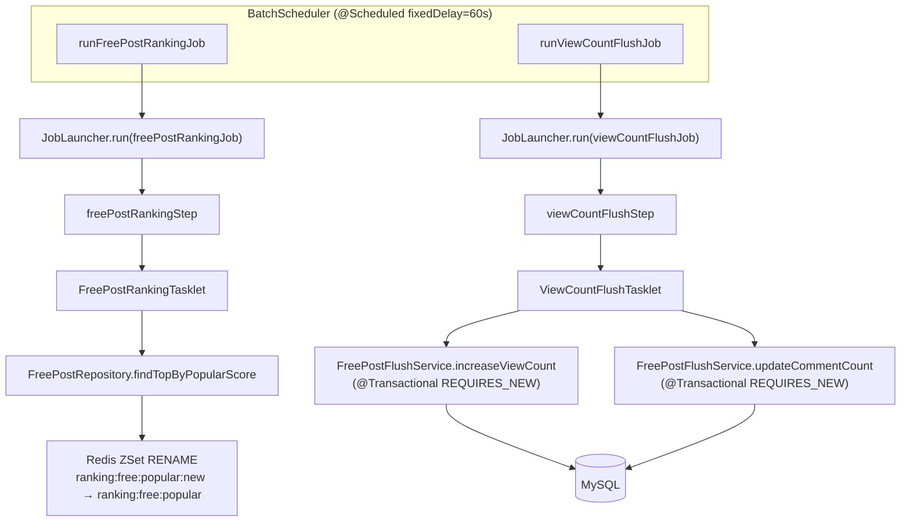

# ARCHITECTURE — pocat-batch

---

## 패키지 트리

```
com.rocketcrew.pocatbatch/
├── PocatBatchApplication
├── config/
│   ├── BatchConfig              # JobRepository, JobLauncher, TransactionManager 설정
│   ├── JpaConfig                # DataSource, EntityManagerFactory 설정
│   └── RedisConfig              # RedisTemplate, StringRedisTemplate 설정
├── domain/freepost/
│   ├── entity/
│   │   ├── BaseEntity           # createdAt, updatedAt (MappedSuperclass)
│   │   └── FreePost             # 자유게시판 게시글 엔티티 (메인 앱에서 복제)
│   ├── repository/
│   │   └── FreePostRepository   # JPA 레포지토리 (인기 점수 정렬 조회 포함)
│   └── service/
│       └── FreePostFlushService # 조회수·댓글수 DB 반영 (@Transactional REQUIRES_NEW)
├── job/
│   ├── ranking/
│   │   ├── FreePostRankingJobConfig   # freePostRankingJob, freePostRankingStep 빈 등록
│   │   └── FreePostRankingTasklet     # 랭킹 조회 → Redis ZSet RENAME
│   └── viewcount/
│       ├── ViewCountFlushJobConfig    # viewCountFlushJob, viewCountFlushStep 빈 등록
│       └── ViewCountFlushTasklet      # Redis 버퍼 → MySQL 플러시
└── scheduler/
    └── BatchScheduler           # @Scheduled(fixedDelay=60s) — JobLauncher 실행 트리거
```

---

## Job/Step/Tasklet 흐름



### 텍스트 다이어그램 (Mermaid 미지원 환경)

```
BatchScheduler(@Scheduled fixedDelay=60s)
  ├─ runFreePostRankingJob()
  │    └─ JobLauncher.run(freePostRankingJob)
  │         └─ freePostRankingStep
  │              └─ FreePostRankingTasklet
  │                   ├─ FreePostRepository.findTopByPopularScore
  │                   └─ Redis ZSet RENAME(ranking:free:popular:new → ranking:free:popular)
  │
  └─ runViewCountFlushJob()
       └─ JobLauncher.run(viewCountFlushJob)
            └─ viewCountFlushStep
                 └─ ViewCountFlushTasklet
                      ├─ FreePostFlushService.increaseViewCount (@Transactional REQUIRES_NEW)
                      └─ FreePostFlushService.updateCommentCount (@Transactional REQUIRES_NEW)
```

---

## Redis 키 표

| 키 | 용도 | TTL |
|----|------|-----|
| `ranking:free:popular` | 자유게시판 인기 랭킹 ZSet (서빙용) | 70s |
| `ranking:free:popular:new` | 랭킹 갱신 임시 키 (RENAME 전) | - |
| `view:free:buffer` | FreePost 조회수 버퍼 (게시글 ID → 조회수 증가량) | - |
| `view:free:buffer:processing` | 조회수 플러시 처리 중 키 (RENAME 후) | - |
| `view:free:buffer:processing:failed` | 조회수 플러시 실패 재처리 큐 | 24h |
| `comment:free:buffer` | FreePost 댓글수 버퍼 (게시글 ID → 댓글수 증가량) | - |
| `comment:free:buffer:processing` | 댓글수 플러시 처리 중 키 (RENAME 후) | - |
| `comment:free:buffer:processing:failed` | 댓글수 플러시 실패 재처리 큐 | 24h |

---

## 트랜잭션 경계

| 레이어 | 클래스 | 전파 수준 | 이유 |
|--------|--------|-----------|------|
| Tasklet | `FreePostRankingTasklet` | Spring Batch 기본 (Step 트랜잭션) | 랭킹 조회는 읽기 전용; Redis RENAME은 원자적 |
| Tasklet | `ViewCountFlushTasklet` | 트랜잭션 없음 (서비스 위임) | 레코드별 독립 처리 위해 서비스 계층에 위임 |
| Service | `FreePostFlushService.increaseViewCount` | `REQUIRES_NEW` | 게시글별 독립 커밋; 하나 실패가 전체 롤백 전파 방지 |
| Service | `FreePostFlushService.updateCommentCount` | `REQUIRES_NEW` | 동상 (게시글별 독립 커밋) |

> `REQUIRES_NEW` 사용 이유: Redis 버퍼에서 읽은 게시글 ID 목록을 순회하며 건별로 DB 업데이트할 때, 특정 게시글 업데이트 실패가 전체 배치 롤백으로 이어지지 않도록 격리. 실패 항목은 `*:failed` 키에 재적재하여 다음 주기에 재처리.

---

## Spring Batch 메타테이블

MySQL에 자동 생성되는 `BATCH_*` 테이블로 Job 실행 이력을 영속 관리한다.

| 테이블 | 용도 |
|--------|------|
| `BATCH_JOB_INSTANCE` | Job 인스턴스 (이름 + JobParameter 조합) |
| `BATCH_JOB_EXECUTION` | Job 실행 기록 (시작·종료·상태) |
| `BATCH_JOB_EXECUTION_PARAMS` | Job 실행 시 파라미터 |
| `BATCH_STEP_EXECUTION` | Step 실행 기록 |

> 운영 환경에서는 BATCH_* 테이블을 별도 스키마(`batch`)에 분리 운영 권장.

---

## 보안 설계 결정

| 항목 | 결정 |
|------|------|
| DB 크리덴셜 | 환경변수(`${DB_URL}`, `${DB_USERNAME}`, `${DB_PASSWORD}`) — 코드 하드코딩 없음 |
| Redis 인증 | `${REDIS_PASSWORD:}` — 운영 환경 `requirepass` 설정 필수 |
| dotenv 우선순위 | OS 환경변수 > `.env` 파일 (OS 환경변수 존재 시 `.env` 값 무시) |
| BATCH_* 스키마 | `initialize-schema: always` (개발용) — 운영 배포 시 `never`로 변경 필수 |
| Actuator 노출 | `health, info, metrics` 최소 범위만 노출 |
| `.env` 파일 | `.gitignore` 에 포함 — Git 커밋 방지 |

## 알려진 한계 (Known Limitations)

| 항목 | 내용 | 대응 방안 |
|------|------|-----------|
| 병행 운영 | 메인 앱 `@Scheduled` 스케줄러와 배치 서버가 동시 실행 시 동일 Redis 키 조작 가능 | 운영 배포 전 메인 앱 스케줄러 비활성화 |
| Redis 비원자성 | `rename(buffer, processing)` 후 서버 재시작 시 중간 상태 잔류 — 다음 사이클에 `processingKey hasKey` 로직으로 복구 | 수용 가능. 고가용성 요구 시 Lua 스크립트 원자화 검토 |
| 다중 배치 인스턴스 | 배치 서버 다중 배포 시 중복 실행 방지 없음 | ShedLock 도입 (별도 ADR) |
| 테스트 Redis 의존 | 통합 테스트가 실제 Redis 서버 필요 | Testcontainers 또는 embedded-redis 도입 권장 |
